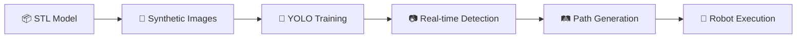

# 🚀 STL Vision PathPlanner

<div align="center">


<h3>🎯 Transform 3D STL Models into Real-Time Object Detection & Robotic Tool Paths</h3>

<p><i>From CAD to Camera to Robot — All in One Pipeline! 🤖</i></p>

[Features](#-features) • [Demo](#-demo) • [Installation](#-installation) • [Usage](#-usage) • [ROS2](#-ros2-integration) • [Contributing](#-contributing)

</div>

---

## ✨ What is This Magic?

**STL Vision PathPlanner** is a complete pipeline that:

1. 📦 Takes your **3D STL model** (CAD file)
2. 🎨 Generates **synthetic training images** with augmentation
3. 🧠 Trains a **YOLOv8 AI model** to detect your object
4. 📷 Runs **real-time detection** with Intel RealSense camera
5. 🛤️ Generates **robotic tool paths** around detected objects
6. 🤖 Exports **ROS2-compatible YAML** for robot control

> 💡 **No manual labeling required!** The system auto-generates labeled training data from your 3D model.

---

## 🎬 Demo

<div align="center">

| Detection | Path Visualization |
|:---------:|:------------------:|
|  |  |

</div>

---

## 🔥 Features

### 🎯 Core Capabilities

| Feature | Description |
|:-------:|:------------|
| 🏭 **Synthetic Data Generation** | Auto-generate thousands of training images from STL |
| 🧠 **YOLO Training Pipeline** | One-command training with augmentation |
| 📷 **RealSense Integration** | 3D coordinates + orientation from depth |
| 🛤️ **6 Path Strategies** | Contour, Spiral, Zigzag, Surface, Grid, Approach |
| 🔴 **Collision Avoidance** | Depth-based obstacle detection |
| 📝 **ROS2 Ready** | PoseStamped YAML with quaternions |

### 🎮 Interactive Controls

```
┌─────────────────────────────────────────┐
│  🎮 KEYBOARD CONTROLS                   │
├─────────────────────────────────────────┤
│  p     →  Generate tool path            │
│  1-6   →  Switch strategy instantly     │
│  v     →  Toggle path visualization     │
│  r     →  Reload settings.yaml          │
│  s     →  Save frame                    │
│  +/-   →  Adjust confidence             │
│  q     →  Quit                          │
└─────────────────────────────────────────┘
```

### 🌀 Path Strategies

| # | Strategy | Pattern | Best For |
|:-:|:--------:|:-------:|:---------|
| 1 | `contour` | 🔵 Elliptical | Inspection, Welding |
| 2 | `approach` | 📍 Pick-place | Grasping |
| 3 | `grid` | ▦ Raster | Scanning, Coating |
| 4 | `surface` | 🌊 Depth-aware | Complex surfaces |
| 5 | `spiral` | 🌀 Inward/Out | Polishing |
| 6 | `zigzag` | ⚡ Back-forth | Coverage |

---

## 📦 Installation

### Prerequisites

- Python 3.8+
- Intel RealSense camera (optional, webcam works too)
- NVIDIA GPU (recommended for training)

### Quick Install

```bash
# Clone the repository
git clone https://github.com/Rohit11-OG/STL-Vision-Pathplanner-.git
cd STL-Vision-Pathplanner-

# Install dependencies
pip install -r requirements.txt

# Verify installation
python main.py info
```

---

## 🚀 Usage

### 1️⃣ Full Pipeline (STL → Detection → Path)

```bash
# Generate data, train model, run detection
python main.py full --stl your_object.stl --epochs 50
```

### 2️⃣ Step-by-Step

```bash
# Generate synthetic training data
python main.py generate --stl bottle.stl --num-images 500

# Train the detector
python main.py train --epochs 100

# Run real-time detection with path generation
python main.py path --strategy spiral --camera 0
```

### 3️⃣ Configuration

Edit `settings.yaml` for custom settings:

```yaml
detection:
  confidence: 0.65

path_planning:
  strategy: contour
  num_waypoints: 20
  velocity: 0.1  # m/s

visualization:
  show_path: true
```

---

## 🛤️ Tool Path Output

Generated paths are saved as ROS-compatible YAML:

```yaml
header:
  frame_id: "camera_link"
  
path:
  waypoints:
    - pose:
        position: {x: 0.15, y: 0.05, z: 0.55}
        orientation: {x: 0, y: 0, z: 0.38, w: 0.92}
      velocity: 0.1
      time_from_start: {sec: 0, nanosec: 500000000}
```

---

## 🤖 ROS2 Integration

### Launch Detection Node

```bash
ros2 launch stl_detector_ros2 detection.launch.py
```

### Topics

| Topic | Type | Description |
|:------|:-----|:------------|
| `/tool_path` | nav_msgs/Path | Generated path |
| `/detections` | DetectionArray | Object detections |

### Publish Path Service

```bash
ros2 service call /publish_latest_path std_srvs/srv/Trigger
```

---

## 📁 Project Structure

```
STL-Vision-Pathplanner/
├── 🎯 main.py                 # CLI entry point
├── 🧠 train_detector.py       # YOLO training
├── 📷 realtime_detector.py    # Detection + visualization
├── 🛤️ tool_path_planner.py    # Path generation
├── 🎨 data_generator.py       # Synthetic data
├── ⚙️ config.py               # Configuration
├── 📝 settings.yaml           # User settings
├── 🤖 ros2_path_publisher.py  # ROS2 node
└── 📦 stl_detector_ros2/      # ROS2 package
```

---

## 🎯 Workflow



---

## 🛠️ Tech Stack

<div align="center">

| Technology | Purpose |
|:----------:|:--------|
| 🐍 Python | Core language |
| 🔥 PyTorch | Deep learning |
| 👁️ YOLOv8 | Object detection |
| 📸 OpenCV | Image processing |
| 📷 RealSense | 3D camera |
| 🤖 ROS2 | Robot integration |
| 🎨 Trimesh | STL processing |

</div>

---

## 🤝 Contributing

Contributions are welcome! 

1. Fork the repository
2. Create your feature branch (`git checkout -b feature/AmazingFeature`)
3. Commit your changes (`git commit -m 'Add AmazingFeature'`)
4. Push to the branch (`git push origin feature/AmazingFeature`)
5. Open a Pull Request

---

## 📄 License

This project is licensed under the MIT License - see the [LICENSE](LICENSE) file for details.

---

## 🙏 Acknowledgments

- [Ultralytics](https://ultralytics.com/) for YOLOv8
- [Intel RealSense](https://www.intelrealsense.com/) for depth sensing
- [ROS2](https://ros.org/) community

---

<div align="center">

### ⭐ Star this repo if you find it useful!

Made with ❤️ by [Rohit](https://github.com/Rohit11-OG)

</div>
